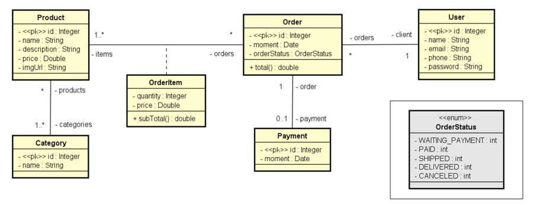

[JAVA_BADGE]:https://img.shields.io/badge/java-%23ED8B00.svg?style=for-the-badge&logo=openjdk&logoColor=white
[SPRING_BADGE]: https://img.shields.io/badge/spring-%236DB33F.svg?style=for-the-badge&logo=spring&logoColor=white
[DOCKER_BADGE]: https://img.shields.io/badge/docker-%230db7ed.svg?style=for-the-badge&logo=docker&logoColor=white
[POSTGRES_BADGE]: https://img.shields.io/badge/postgres-%23316192.svg?style=for-the-badge&logo=postgresql&logoColor=white
[SWAGGER_BADGE]: https://img.shields.io/badge/-Swagger-%23Clojure?style=for-the-badge&logo=swagger&logoColor=white
[RENDER_BADGE]: https://img.shields.io/badge/Render-%46E3B7.svg?style=for-the-badge&logo=render&logoColor=white


<h1  align="center" style="font-weight: bold; margin: 50px 0px 50px 0px;">Projeto web services com Spring Boot 💻</h1>


![java][JAVA_BADGE]
![spring][SPRING_BADGE]
![Docker][DOCKER_BADGE]
![Swagger][SWAGGER_BADGE]
![postgres][POSTGRES_BADGE]
![Render][RENDER_BADGE]

<p align="center">
 <a href="#domain_Model">Domain Model</a> • 
 <a href="#started">Getting Started</a> • 
 <a href="#routes">API Endpoints</a> •
 <a href="#documentation_api">Swagger documentation</a> •
 <a href="#colab">Collaborators</a> •
 <a href="#Contact">Contact</a>
</p>

<p>
O objetivo deste projeto é simular uma loja virtual onde os usuários podem realizar pedidos com os produtos cadastrados na loja. Este projeto foi desenvolvido como parte do curso "Java COMPLETO Programação Orientada a Objetos + Projetos", ministrado pelo instrutor Nelio Alves. Durante o curso, o projeto foi desenvolvido até o commit intitulado "Dev profile". No entanto, senti a necessidade de fazer algumas melhorias, como documentar o projeto com Swagger, adicionar variáveis de ambiente e realizar o deploy da aplicação.
</p>

<h2 id="domain_Model">📈Domain Model</h2>




<h2 id="started">🚀 Getting started</h2>

<h3>Cloning</h3>

```bash
git clone https://github.com/PedroHenrique-LS/workshop-springboot3-jpa
```

<h3>Test profile</h3>

```properties
  spring.profiles.active:test
```
<ol>
  <li>Em: src/main/resources/application.properties
  <li>Set o spring.profiles.active para test
  <li> Execute o projeto na sua ide de preferência
</ol>


<h3>Dev profile</h3>

```properties
  spring.profiles.active:dev
```

<h4>Prerequisites</h4>

- [Docker](https://www.docker.com/)
- [Java 17](https://www.oracle.com/java/technologies/downloads/#java17)

<ol>
  <li>Em: src/main/resources/application.properties
  <li>Set o spring.profiles.active para dev
</ol>


<h3> Environment Variables</h2>

No root da aplicação renomeie o arquivo  `.env.example` para `.env` e configure o username e password da base de dados.

```yaml
DB_URL=jdbc:postgresql://db:5432/springboot_course
DB_USERNAME=seu_usuario_aqui
DB_PASSWORD=sua_senha_aqui
```

<h3>Starting</h3>

```shell
cd C:\Users\{seu_usuario}\workshop-springboot3-jpa

docker-compose up
``````


<h2 id="routes">🚄 API Endpoints</h2>


​<h3>🙋🏽 user Endpoints</h3>

| route               | description                                          
|----------------------|-----------------------------------------------------
| <kbd>GET /users/{id}</kbd>     |  Busca um usuário por id
| <kbd>GET /users</kbd>     |  Retorna todos os usuários
| <kbd>POST /users</kbd>     |  Cadastra um no usuário
| <kbd>PUT /users/{id}</kbd>     |  Atualiza um usuário pelo id
| <kbd>DELETE /users/{id}</kbd>     |  Deleta um usuário pelo id

​<h3>🛍️ product Endpoints</h3>

| route               | description                                          
|----------------------|-----------------------------------------------------
| <kbd>GET /products/{id}</kbd>     |  Busca um produto por id
| <kbd>GET /users</kbd>     |  Retorna todos os produtos

​<h3>🗂️ category Endpoints</h3>

| route               | description                                          
|----------------------|-----------------------------------------------------
| <kbd>GET /categories/{id}</kbd>     |  Busca uma categoria por id
| <kbd>GET /users</kbd>     |  Retorna todas as categorias


<h2 id="documentation_api">📄 Swagger documentation</h2>

Para uma documentação completa e interativa da API, por favor, consulte o Swagger disponível em <a href="https://workshop-springboot3-jpa-r8wc.onrender.com/swagger-ui/index.html" target="_blank">https://workshop-springboot3-jpa-r8wc.onrender.com/swagger-ui/index.html</a>

​<h3> Obs:</h3> Por se tratar de um projeto de estudos, a aplicação foi hospedada em uma conta gratuita do <a href="https://render.com/" target="_blank">Render</a>. Isso pode causar uma pequena demora de alguns segundos para acessar a aplicação, tendo em vista que o Render adormece as aplicações gratuitas que não são acessadas por um período de tempo.

<h2 id="colab">🤝 Collaborators</h2>

Meus sinceros agradecimentos a todos que me ajudaram de alguma forma neste projeto, seja tirando uma dúvida, com uma dica de melhoria ou qualquer outro ensinamento que veio a agregar neste projeto.

<table>
  <tr>
    <td align="center">
      <a href="https://www.youtube.com/@DevSuperior" target="_blank">
        <br>
        <sub>
          <b>Nelio Alves</b>
        </sub>
      </a>
    </td>
    <td align="center">
      <a href="https://www.youtube.com/c/DanieleLe%C3%A3o" target="_blank">
        <br>
        <sub>
          <b>Jamerson Souza</b>
        </sub>
      </a>
    </td>
    <td align="center">
      <a href="https://www.youtube.com/c/DanieleLe%C3%A3o" target="_blank">
        <br>
        <sub>
          <b>Daniele Leão</b>
        </sub>
      </a>
    </td>
    <td align="center">
      <a href="https://www.youtube.com/@lucas_angelo" target="_blank">
        <br>
        <sub>
          <b>Lucas Ângelo</b>
        </sub>
      </a>
    </td>
    <td align="center">
      <a href="https://www.youtube.com/@kipperdev " target="_blank">
        <br>
        <sub>
          <b>Fernanda Kipper</b>
        </sub>
      </a>
    </td>
    <td align="center">
      <a href="https://github.com/PedroHenrique-LS">
        <br>
        <sub>
          <b>Pedro Henrique😁</b>
        </sub>
      </a>
    </td>
  </tr>
</table>

<h2 id="Contact">📫 Contact</h2>

 Email: <a href="mailto:ph.laurindo2010@gmail.com">ph.laurindo2010@gmail.com</a>

 Linkedin: <a href="https://www.linkedin.com/in/pedro-h-laurindo/" target="_blank">LinkedIn </a>